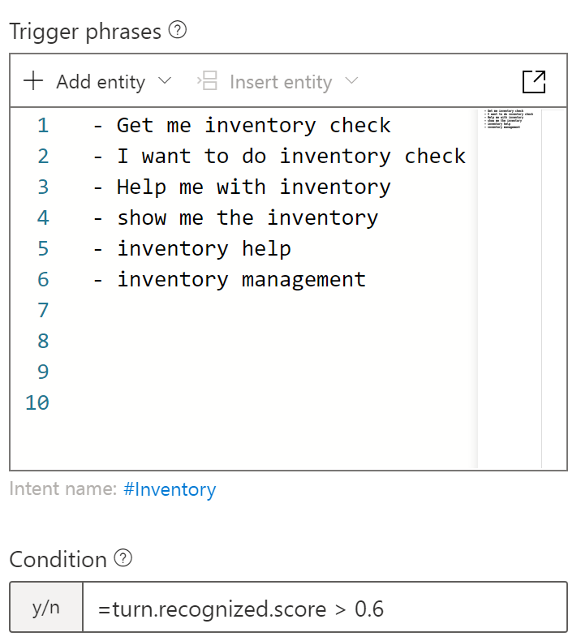

#  RSA - homepage and chat bot

This project is part two of my RSA inventory and Azure chat bot project. This pages idea is to be company's homepage
where you can talk to the chat bot called _Ramses the Inventory Assistant_. You can ask about bot about the company and
get information about the company's inventory.

The page itself is created using React, Webpack and CSS. It is created mobile first.

## [Live version](https://miianyy.github.io/Ramses-The-Chat-Bot/)

## Bot

Bot is created using Microsoft Azure Bot Services. It has been build with Azure Bot Composer, which is visual coding
tool. When I first started creating bot, I noticed that there wasn't many tutorials for coding bot using Node.js only
C#. Because I was not familiar with C#, I decided to use Bot Composer. In hindsight, I think it would have been wiser
and quicker to learn C# than create the bot using Composer.

Bot is connected to QnA Maker Knowledge Base and Azures Language Understanding (LUIS).

The bot is built around different dialogues and triggers. Dialogues are coded conversations between a bot and users. In
the dialog, the bot can ask the user something or just provide information. Triggers are created using Azure's Language
Understanding (LUIS) service. They are created by teaching LUIS different words and phrases and giving the trigger a
conditional statement. When LUIS recognizes a word / phrase, it gives it a confidence score from 0-100%. The 
more confident it is about user intent, the higher the score. The conditional statement is there to tell LUIS that, 
if your confidence score is higher than this (example 60%) fire this particular dialog.

### What it can do

The main functionality is that the bot can connect the user to the inventory database in MongoDB. Through bot, user can
get specific items, create new ones or delete them. This is done by using REST API calls through which bot has access to
the database.

Bot can also tell information about the company and do little chitchat.

## How to test the bot

**To get access to inventory ask:**

- _Inventory management_
- _Add new item to inventory_
- _Delete_ 
  -  to remove item from inventory
- _Get item from inventory_

**Ask about the company:**

- _Tell me about the company_
- _Who is the owner of the company_

**Chitchat with the bot:**

- _Hello_
- _How are you_
- _What is your name_
- _Who created you_

## Technologies

- Microsoft Azure
- Azure Bot Services
    - QnA Maker
    - LUIS
    - Bot Composer
    - Bot Emulator
- React
- Webpack
- CSS

